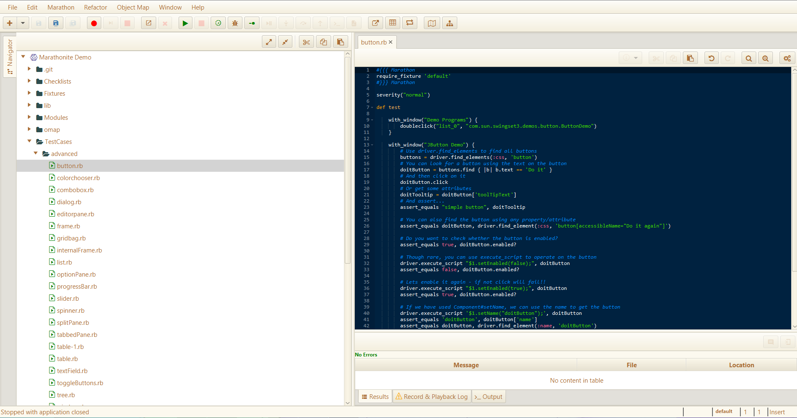

# Marathon Swing Demo

## Description
[Marathon](https://github.com/jalian-systems/marathonv5) is an opensource tool to automate tests for Java Swing&trade; and Java/Fx&trade; applications. This project is a demo project to show capabilities of Marathon test scripts. This demo project can also be used with [MarathonITE](https://marathontesting.com).

**Marathon Swing Demo** contains list of testcases for each swing component. The basic scripts are what Marathon generates by using inbuilt recorder. The advanced folder contains scripts that more or less perform the same functions but using Marathon JavaDriver's [Selenium/WebDriver](https://seleniumhq.org) bindings. The test cases are in Ruby language.

## How to use?
1. Download zip file or clone the project into a folder.
2. If not already installed, Download **Marathon** from [SourceForge Website](https://sourceforge.net/projects/marathonman) and extract the zip into a folder. Marathon requires Java 1.8 to run.
    Or  alternatively Download [MarathonITE](https://marathontesting.com) and install the software.
4. Run the application using **marathon.bat** file for **Windows** and **marathon.sh** for **Linux/mac OS** from terminal.
5. From the **Marathon Project Selection Window** browse for the marathon-swing-demo project.

## Test Cases
The following are the test cases in this project.

Component | Test Case Name  | Notes 
--- | --- | ---
*Button* | `basic/button.rb` `advanced/button.rb` | 
*Color chooser* | `basic/colorchooser.rb` `advanced/colorchooser.rb` |
*Combo box* | `basic/combobox.rb` `advanced/combobox.rb` |
*Dialog* | `basic/dialog.rb` `advanced/dialog.rb` |
*Editor pane* | `basic/editorpane.rb` `advanced/editorpane.rb` |
*Frame* | `basic/frame.rb` `advanced/frame.rb` |
*Grid Layout* | `basic/gridbag.rb` `advanced/gridbag.rb` |
*Internal Farme* | `basic/internalFrame.rb` `advanced/internalFrame.rb` |
*List* | `basic/list.rb` `advanced/list.rb` |
*Option Pane* | `basic/optionPane.rb` `advanced/optionPane.rb` |
*Progress Bar* | `basic/progressBar.rb` `advanced/progressBar.rb` |
*Slider* | `basic/slider.rb` `advanced/slider.rb` |
*Spinner* | `basic/spinner.rb` `advanced/spinner.rb` |
*Split Pane* | `basic/splitPane.rb` `advanced/splitPane.rb` |
*Tabbed Pane* | `basic/tabbedPane.rb` `advanced/tabbedPane.rb` |
*Table View(Components.main)* | `basic/table-1.rb` `advanced/table-1.rb` |
*Table View* | `basic/table.rb` `advanced/table.rb` |
*Text Field* | `basic/textField.rb` `advanced/textField.rb` |
*Toggle Button* | `basic/toggleButtons.rb` `advanced/toggleButtons.rb` |
*Tree* | `basic/tree.rb` `advanced/tree.rb` |
*Window* | `basic/window.rb` `advanced/window.rb` |
